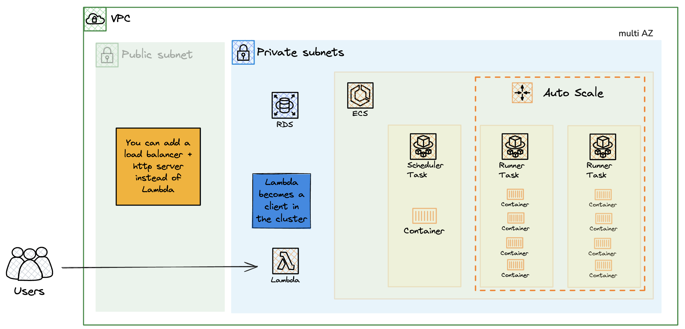

# Effect Cluster + SST Cluster


This repository demonstrates the [Effect Cluster](https://effect-ts.github.io/effect/docs/cluster) running with the [SST Cluster](https://sst.dev/docs/component/aws/cluster) component.

Follow along to learn why and how you might use Effect Cluster to build resilient and scalable applications.


## Table of Contents

- [The Demo](#the-demo)
- [Architecture](#architecture)
- [Running Locally](#running-locally)
- [Deploying to AWS and Managing the Cluster](#deploying-to-aws-and-managing-the-cluster)

## The Demo

We'll be working with a group of mathematicians. They have some peculiar habits, so getting answers from them can be a bit tricky.

Their task is to calculate the Fibonacci sequence as clients request calculations - simple in theory, but not in practice.


#### Meet the Mathematicians

- Professor Prudence Abacus - An elder mathematician who always double-checks results with their assistant. "Measure twice, calculate once" is their motto.
- Dr. Lazlo Procrastino - A brilliant but lazy mathematician who is supremely confident in their abilities but takes forever to complete work. "Genius can't be rushed" is what they say while sipping coffee.

#### Some Facts About Working with These Mathematicians

##### Some of them are very busy, and while you're waiting for an answer they might just walk away.

> "I'm sorry, I have to go. I'm needed at the cafe."
>
> 🖥️ In the cluster: A ProcessCrasher singleton runs on a random node and crashes the process every 1.5 minutes. Using an ECS Task Definition restart policy, the container restarts automatically.

##### Sometimes they are superstitious about the number 13. You can get a response if you insist.

> "I'm sorry I don't calculate with the number 13."
>
> 🖥️ In the service: A mathematician that receives the number 13 will return a BadLuckMath error half the time.

##### Timeouts, timeouts, timeouts.

> "I'm sorry, I'm not used to doing this many calculations."
>
> 🖥️ In the cluster: CPU is a limited resource - the more calculations you request and the more complex they are, the longer they take. Additional factors include your patience to wait (Effect.timeout) and retry attempts (Effect.retry).

---

### Explore the Code

The domain logic is the core of this application. Start by examining the [Mathematician](./src/domain/mathematician.ts) entity and follow how it's used throughout the codebase.

```ts
export const Mathematician = Entity.make("Mathematician", [
```

Clients use message passing to interact with the Entity, which could be running anywhere in the cluster.

```ts
const client = yield* Mathematician.client;
// ...
client(nodeId).CalculateFibonacci({ target }).pipe(Effect.exit)
```

Since this returns an Effect (transformed into an Exit to recover from interruptions), we can manipulate it like any other Effect value.

The main files to examine are:

- [src/domain/mathematician.ts](./src/domain/mathematician.ts) - The domain logic for the mathematicians.
- [cmd/do-math.ts](./cmd/do-math.ts) - The command that runs calculations locally.
- [src/serverless/lambda.ts](./src/serverless/lambda.ts) - Similar to the do-math command, but running in a Lambda function.
- [src/runner.ts](./src/runner.ts) - The entry point for the runner in the cluster.
- [sst.config.ts](./sst.config.ts) - The SST configuration for the cluster.

Feel free to fork this code and make your own changes.

You'll gain valuable insights by running the code locally and deploying to AWS. It's fun to test different calculation settings with different cluster sizes and see how they affect results.

- [Running Locally](#running-locally)
- [Deploying to AWS and Managing the Cluster](#deploying-to-aws-and-managing-the-cluster)

### Takeaways

In real-world applications, things fail constantly. Building a distributed system means accepting and embracing this fact. We should build systems resilient to failure, so users get results or clear feedback when the system can't self-recover and their intervention is needed.

In this demo, Effect primitives model complex behaviors declaratively end-to-end. Effect code unlocks a new way of reasoning about code, where:

- Computations are values called Effects. They can be composed, transformed, and run in different ways.
- Errors are values, explicitly typed for full control of error handling.
- Executions are values called Fibers, providing explicit control over execution lifetime. Compare with a traditional Promise/AbortController to see the difference.
- Effects explicitly declare their dependencies. No prop drilling or context objects. Running an Effect without fulfilling its dependencies results in a compile-time error.
- Observability has first-class support, exportable to all types of OTEL and non-OTEL compatible tools.

I believe Effect gets many things right, from its fundamental primitives to its APIs and libraries.

Each software product has unique characteristics requiring different technical solutions, but many products would benefit from using Effect.

Teams are free to build what fits them, but the problem arises when they build a worse in-house version of Effect. Software that's hard to debug, deeply coupled, and fragile is painful for developers and users alike - and not good for profit.

For more information on why Effect, check out the [Why Effect](https://effect.website/docs/getting-started/why-effect/) documentation.

## Architecture



SST has been my go-to choice for IAC for many years. You can see some of my reasons on [YouTube](https://www.youtube.com/watch?v=2oJ41crXoWU&t).

The overall architecture is simple. The focus is demonstrating Effect Cluster and SST Cluster integration. SST adds infrastructure composition on top of Effect Cluster.

In the ongoing debate between serverless and containers, I choose to be pragmatic. **The use case drives the architecture.** There's no reason to commit fully to one paradigm when you can choose the best tool for each job. SST excels at managing and composing both paradigms together.

---

##### On Production Readiness

Effect Cluster is in alpha to the best of my knowledge. Using it in production is for the brave at the moment, but it's definitely a good time to start learning about it.

To improve production readiness, consider these adaptations:

- Runners currently use spot capacity. This is great for cost but not for availability. A good compromise would be using a mix of spot and on-demand capacity, which the SST Service component supports.
- Set ECS scaling policies to automatically scale the cluster based on CPU/memory usage.
- In the VPC, using a NAT Gateway instead of NAT Instance is a better option.
- The database is small, meant for a cheap development environment. In production, use Aurora Serverless for a powerful and cost-effective database.
- Setting up an observability stack with OTEL and a tracing tool like Tempo is essential for production.

## Running Locally

```bash
$ nix develop -c $SHELL
$ pnpm install

# Run the cluster locally (scheduler + runner)
$ ./scripts/cluster-dev-mode.ts

# Run some math against the cluster
$ ./cmd/do-math.ts
```

## Deploying to AWS and Managing the Cluster

```bash
$ nix develop -c $SHELL
$ pnpm install

# Deploy the infrastructure and cluster to AWS
$ npx sst deploy --stage demo

# Manage the cluster without logging into the AWS console
$ ./scripts/manage-ecs-cluster.ts
```